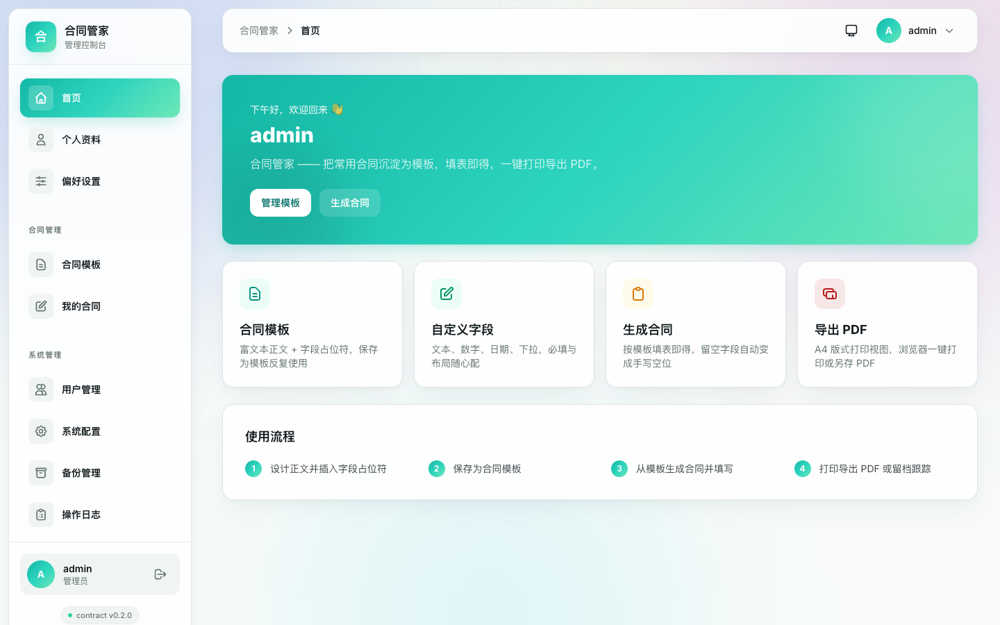
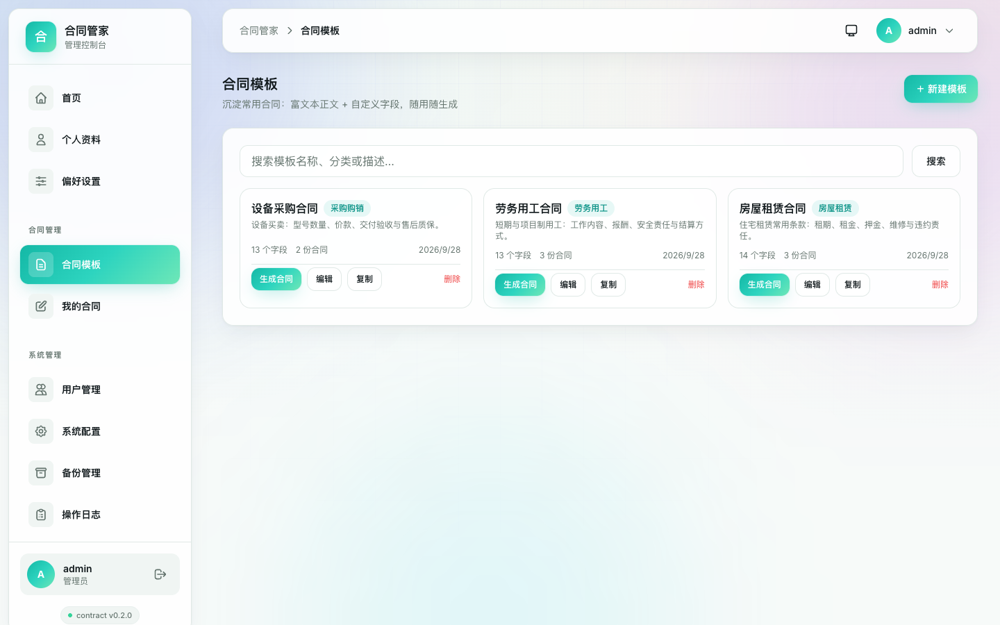
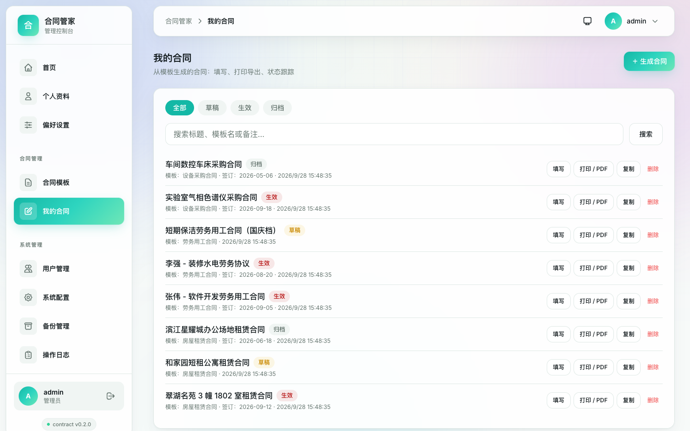
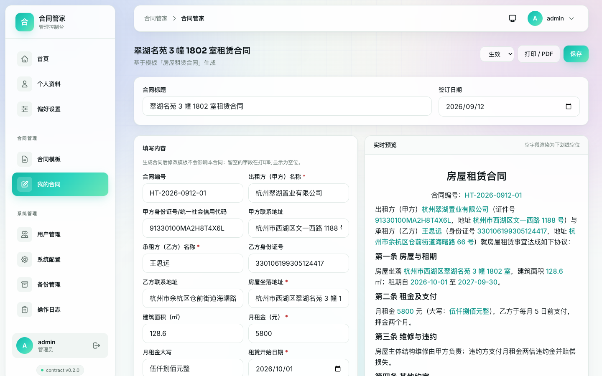
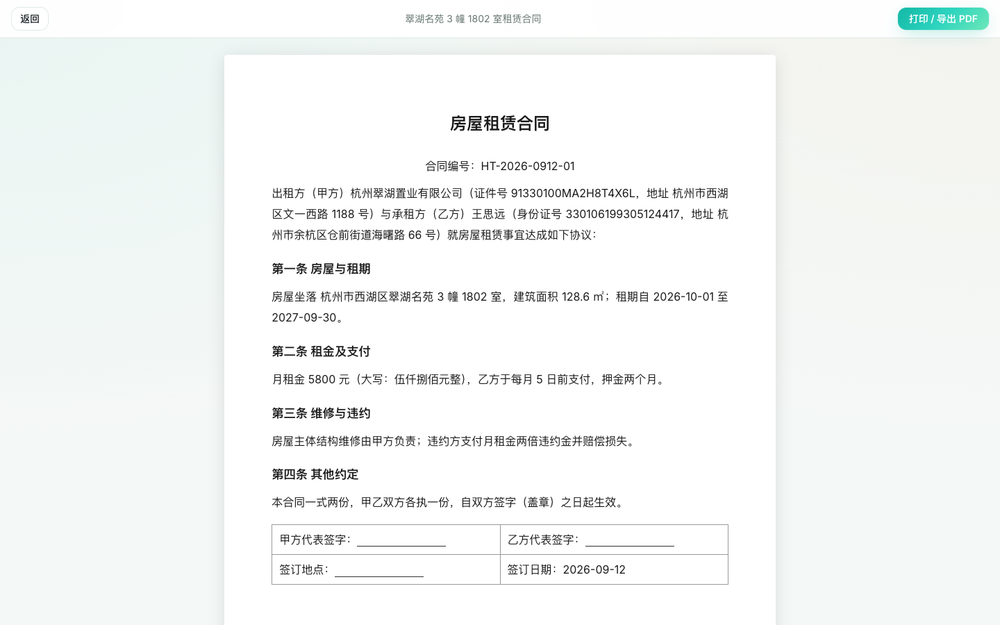
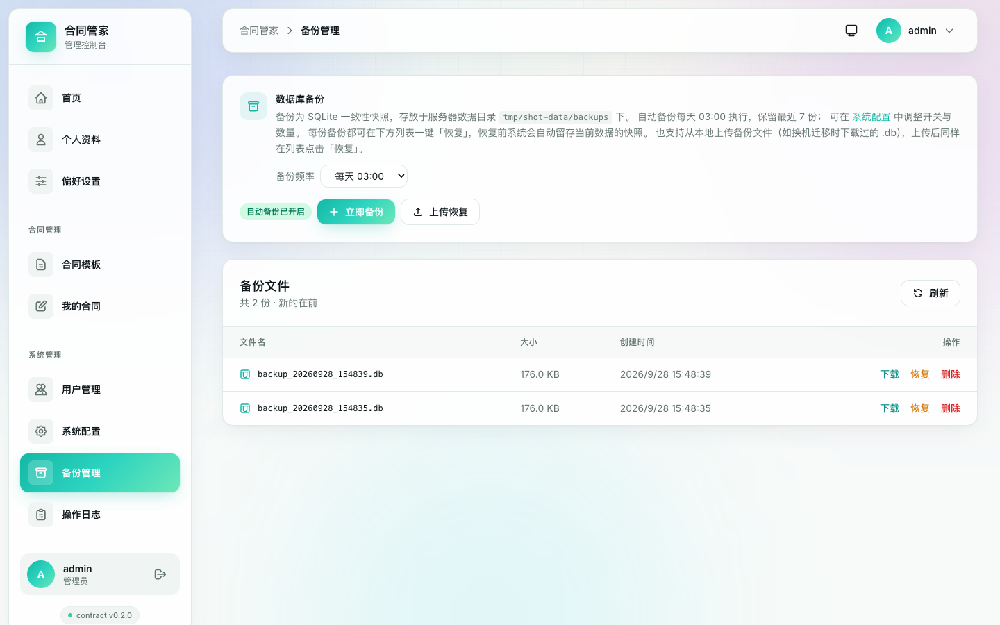
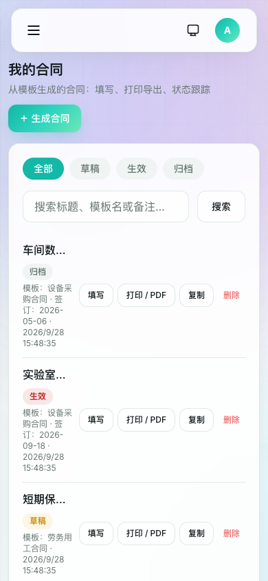
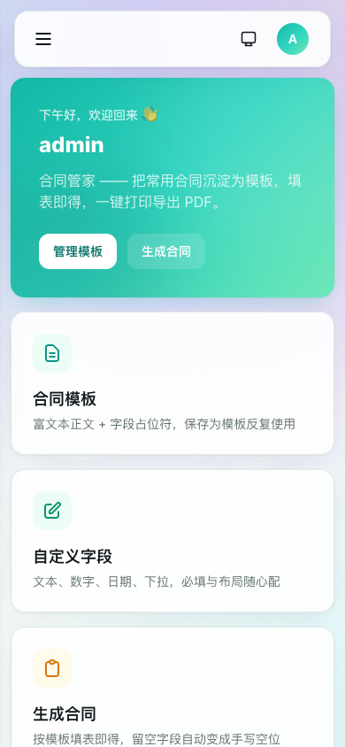

# 合同管家（contract）

面向个人与小微团队的轻量合同管理 Web 应用：把常用合同沉淀为"模板 + 字段"，生成合同时填表即得，一键打印或另存为 PDF。

基于 [smallgo](https://gitee.com/TechFunWay/smallgo) 应用框架实例化（Go/Gin/GORM/SQLite + Vue 3/TS/Vite/Pinia/Tailwind），与家族应用（bill、reminders、rental、worklog）同构，默认端口 **8911**。

## 下载与安装

| 渠道 | 获取方式 |
|---|---|
| GitHub Releases | <https://github.com/TechFunWay/contract/releases> —— 各平台压缩包、飞牛 `fpk` 安装包与 `docker-compose.yml` |
| Gitee 发行版 | <https://gitee.com/TechFunWay/contract/releases> —— 国内镜像，产物与 GitHub 一致 |
| Docker 镜像 | `docker pull techfunways/contract:latest`（amd64 / arm64 多平台） |
| 飞牛 fnOS | 在飞牛应用中心手动安装 Releases 里的 `.fpk` 安装包（amd64 / arm64） |
| 官网介绍页 | <https://techfunway.wycto.cn/fnapp/contract> |

> 默认端口 `8911`；数据默认是挂载目录下的 SQLite 单文件，备份即拷贝，恢复支持上传本地备份文件。

## 界面预览

> 以下截图为 v0.2.0 实拍，数据为演示用示例数据。

**工作台**：合同与模板一屏总览



**合同模板**：富文本正文 + 自定义字段，保存为模板即可复用



**合同列表**：草稿 / 生效 / 归档状态一目了然，支持关键字筛选



**填写合同**：填表单即得正文，金额大写自动转换



**打印视图**：A4 版式 + 手写签名横线，一键打印或另存 PDF



**数据备份**：快照备份、一键恢复与本地上传恢复



**手机端**（390 × 844）：列表与工作台

<p>
  
  
</p>

其余截图（模板编辑器、用户管理、手机端填写页）见 [images/screenshots/](images/screenshots/)，同一套图也随发行目录分发（`release/<版本>/screenshots-<版本>.zip`）。

## 功能一览

- **合同模板**：富文本正文编辑（标题、加粗、列表、对齐…），正文中插入自定义字段占位符（甲方名称、金额、日期……），整体保存为模板
- **字段设计**：单行/多行文本、数字、日期、下拉选择；必填、填写宽度、占位提示；可增删改排序
- **生成合同**：选模板 → 填表单 → 占位符自动代入；留空字段渲染为下划线空位，打印后可手工补填
- **快照存储**：合同保存模板正文与字段定义的完整快照，模板后续修改不影响已生成的合同
- **状态管理**：草稿 → 生效 → 归档；签订日期与备注；关键字/状态/模板筛选
- **导出 PDF**：独立 A4 打印视图，一键调起浏览器打印或"另存为 PDF"
- **框架能力**：登录认证、飞牛 NAS 一键登录、用户管理、系统配置、备份、审计日志、明暗主题、赞赏支持、版本检查

## 快速开始

```bash
# 开发
cd server && go run .            # 后端 API（默认 :8911）
cd web && npm run dev            # 前端 Vite :3000（代理 /api 到后端）

# 生产构建（前端必须先于后端）
make build                       # 前端产物进 server/static/dist/，后端出 build/contract

# 冒烟测试
./scripts/smoke.sh

# 打包
make fnpack                      # 飞牛 fpk（appname: techfunway-contract）
make build-docker                # Docker 镜像（techfunways/contract）
```

首次访问注册的第一个用户成为管理员。

## 目录

```
contract/
├── AGENTS.md          AI 协作说明（架构、命令、约定）
├── docs/              需求规格说明书 / 概要设计 / 详细设计 / 测试计划
├── server/            Go 后端（模块 smallgo/server）
│   └── contract/      业务模块：模板、合同、渲染、清洗
├── web/               Vue 3 前端
├── fnpack/            飞牛打包配置
└── scripts/           构建 / 打包 / 冒烟脚本
```

## 设计文档

| 文档 | 内容 |
|---|---|
| [docs/01-需求规格说明书.md](docs/01-需求规格说明书.md) | 需求来源、功能与非功能需求 |
| [docs/02-概要设计.md](docs/02-概要设计.md) | 架构、模块划分、数据流 |
| [docs/03-详细设计.md](docs/03-详细设计.md) | 数据模型、渲染/清洗规则、API、前端组件 |
| [docs/04-测试计划与验收报告.md](docs/04-测试计划与验收报告.md) | 自动化用例与手工验收清单 |
